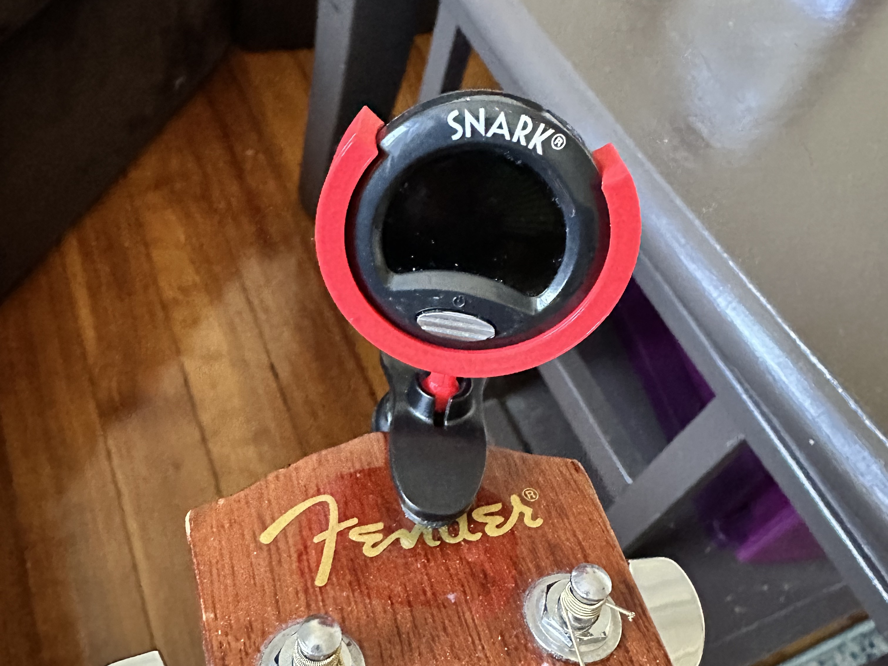
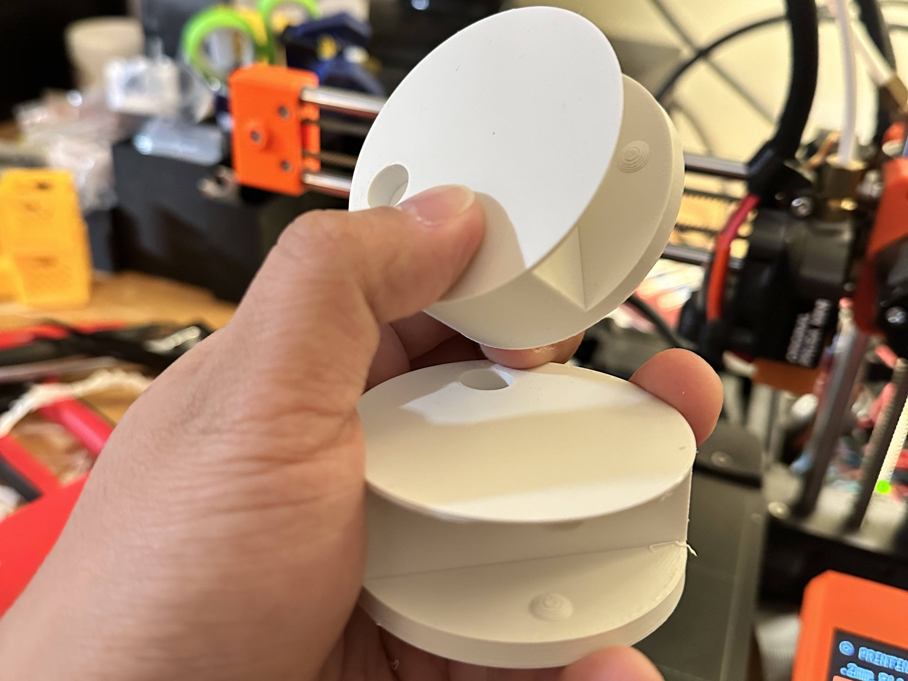
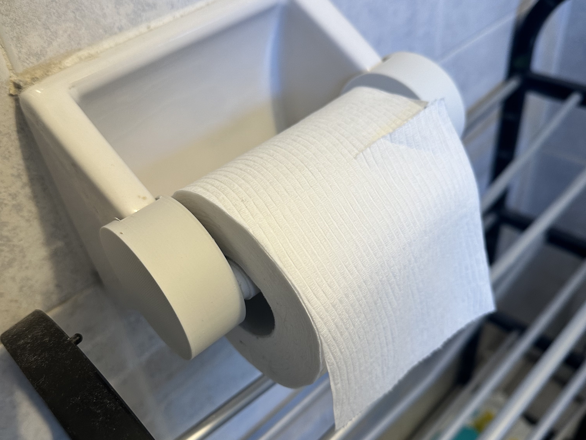
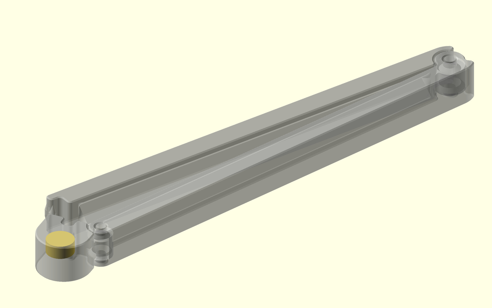
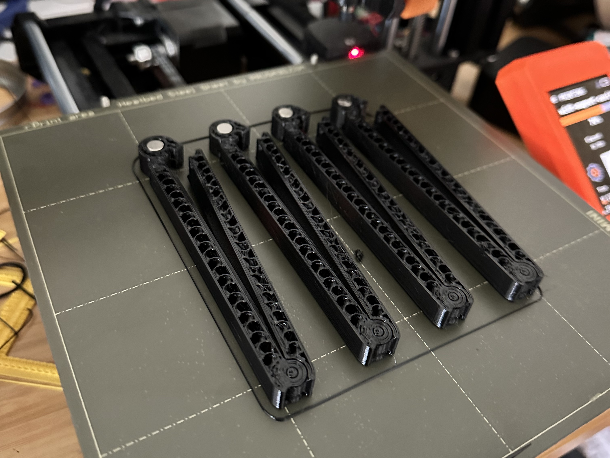
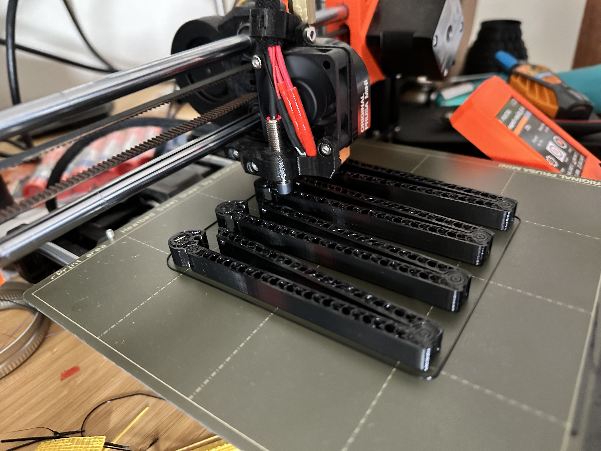
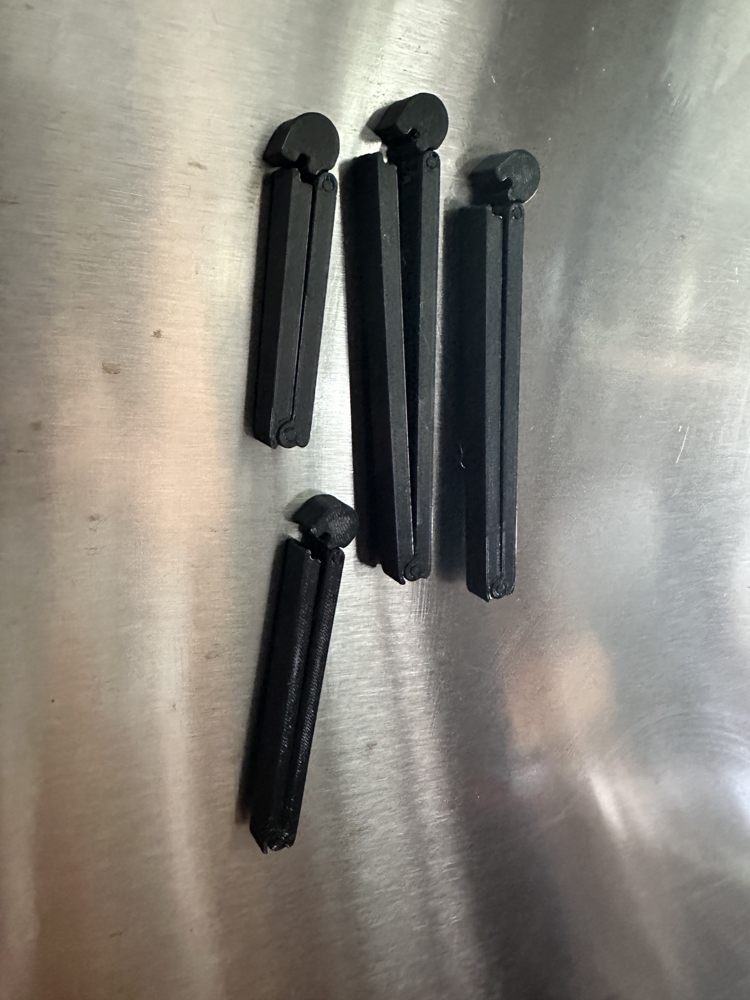
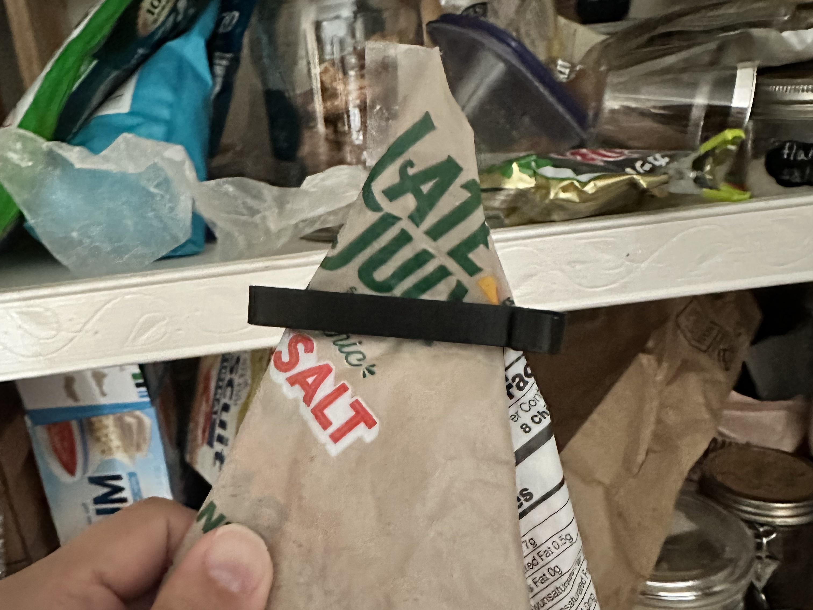

One particular joy of 3D printing is the discovering some potential quality of life improvement, searching it up on [Printables][], [Thingiverse][], or any other 3D model repository and — lo and behold someone has designed a model for that! You pop the file into your 3D printer – maybe with a quick stopover at your [slicer][prusaslicer] – et voilà, problem solved.

[Printables]: https://www.printables.com/
[Thingiverse]: https://www.thingiverse.com/
[prusaslicer]: https://www.prusa3d.com/prusaslicer/

It's pretty thrilling, even without ever doing any design yourself. It's especially thrilling when the problems are too niche to have widely available commercial solutions. 3D printing extends the long tail of practical objects. As an example, here's a design [I found online][tuner] to replace the broken ball joint on my guitar tuner, extending its lifespan:

[tuner]: https://www.thingiverse.com/thing:4072679



Plenty of people spend most of their 3D printing time in this space – finding designs online and printing them at home. Sometimes, though, you have a need too specific to be solved by a premade design.

For example: One common problem with old toilet paper holders is that they're sized for the "normal" rolls of yesteryear, not the "mega" rolls of today. There's [plenty of designs][tpextenders] for toilet paper holder extenders available, but I couldn't find one that looked like it would fit our specific holder. So I designed my own:

[tpextenders]: https://www.printables.com/search/all?q=toilet%20paper%20extender


    
    


There's also an option between the premade and the fully bespoke: Finding a design close to your needs and modifying it. I recently downloaded [this design for pantry bag clips][clips]. They're excellent — durable and secure[^1]. But I wanted them to stick to my fridge so I could always find them when needed. I do most of my designing in [OpenSCAD][], a coding based 3D modeling environment. I wrote this code to add a cavity to the clip where I could insert magnets:

[clips]: https://www.printables.com/model/229538-print-in-place-bag-clip-2-parametric/
[OpenSCAD]: https://openscad.org/

```scad
// Render circles at high detail
$fa = 0.1;
$fs = 0.01;

clip_height = 10;

// Define the space to fit two 6x1.5mm magnets (with a little extra space)
magnet_height = 3.5;
magnet_radius = 3.5;

difference () {
    // Import the clip file and position it above the XY plane
    translate([0, 0, clip_height / 2])
    import("100-mm-bag-clip-2.3mf");

    // Add an internal cavity for the magnets
    translate([-5, 60.5, clip_height - magnet_height - 1])
    cylinder(h=magnet_height, r=magnet_radius);
}
```

which yields this (clip rendered transparent to make internal cavity visible):



I sliced the model in [Prusa Slicer][prusaslicer] and added a pause at the top of the cavity, which tells my 3D printer to print that far, then alert me and wait for me to insert the magnets before continuing[^2].


    
    


And the finished product, with the magnets fully sealed inside:


    
    


[clips]: https://www.printables.com/model/229538-print-in-place-bag-clip-2-parametric/comments/1151095

[^1]: They're perhaps a bit too secure – surprisingly and inadvertently effective at locking housemates with less hand strength out of the pantry snacks.
[^2]: Because parts of the print head are magnetic and will pull up the magnets as it passes back over them, I had to use a bit of superglue to adhere the magnets in place.
