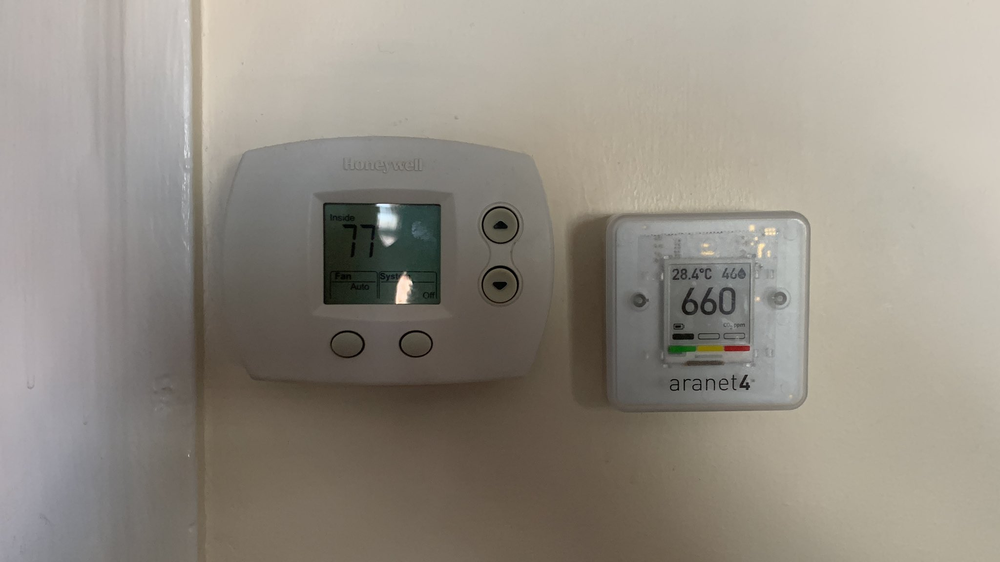

I get the questions from time to time about the CO₂ monitor I use. It’s an Aranet4. It’s the kind I saw a lot of ventilation experts like [Linsey Marr](https://cee.vt.edu/people/faculty/lmarr.html) using and I understand it’s well validated to be accurate. I was probably also unduly influenced by how cute and clever it is.

It has *excellent* battery life, running for *years* on a pair of AA batteries. This makes it possible to run perpetually. It’s small and portable, but when it’s not on the road with me, it hangs on the wall, constantly monitoring next to my thermostat, useful when hosting.

It costs ~$250 but Clean Air Crew often has a [discount coupon available](https://cleanaircrew.org/aranet4coupon/).

My friend has a Temtop M2000. It *also* does particulate measurements—useful if you want to measure *filtration* in addition to ventilation. Aranet4 does not. The Temtop doesn’t have the same battery life or small size though. It retails for ~$225, but is often on sale as low as $175. Both of these models can display the current readings *and* record readings over time.

There are cheaper CO₂ monitors, but I personally don’t know how to assess their reliability and I haven’t seen any cheaper ones that *record* readings, so you can produce graphs like this:

<blockquote class="twitter-tweet" data-conversation="none" data-dnt="true">
Anyway, here’s the CO₂ chart for my <a href="https://twitter.com/GreyhoundBus?ref_src=twsrc%5Etfw">@GreyhoundBus</a> rides. Higher than my Amtrak readings. Hope the bus has good filters, or I’d expect buses to be superspread environments  Short peak is bus #1. Spike after is when I boarded bus #2, then got off cuz the driver wasn’t ready to go. <a href="https://t.co/CYJa3c58Y6">pic.twitter.com/CYJa3c58Y6</a>
&mdash; Harris Lapiroff (@harrislapiroff) <a href="https://twitter.com/harrislapiroff/status/1555606785041612801?ref_src=twsrc%5Etfw">August 5, 2022</a></blockquote>  

As ever, I have no professional expertise in ventilation, virology, or epidemiology, so my advice comes with a grain of salt. I have a degree in Mathematics and am a software engineer so I’m pretty good at understanding data and reading papers. I welcome additions from experts.
